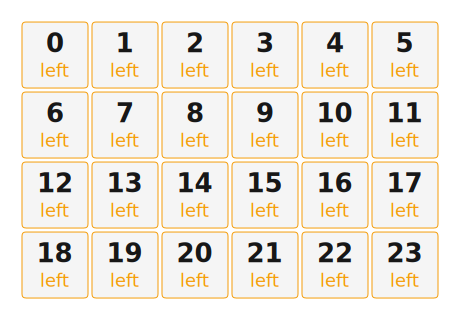

# ZMK Configuration for ortho20/20

*Generated by Shield Wizard for ZMK*



Download compiled firmware from the Actions tab. <https://zmk.dev/docs/user-setup#installing-the-firmware>

Edit your keymap <https://zmk.dev/docs/keymaps>.
User keymap is located at [`config/ortho20_20.keymap`](config/ortho20_20.keymap).

-----

<details>
<summary>
Shield Wizard Debug Information
</summary>

In case of broken configuration, here is the Shield Wizard internal data used to generate this configuration:

Commit: 8a52249f61161469b6d90ed8c80c4aa52b9f3858

```json
{"name":"ortho20/20","shield":"ortho20_20","dongle":false,"modules":[],"layout":[{"id":"01KJSP9MJ8WPAMRX8NHAGE70QA","part":0,"row":0,"col":0,"x":0,"y":0,"w":1,"h":1,"r":0,"rx":0,"ry":0},{"id":"01KJSP9MJ8CQ1HK54ASC5XJ02J","part":0,"row":0,"col":1,"x":1,"y":0,"w":1,"h":1,"r":0,"rx":0,"ry":0},{"id":"01KJSP9MJ8KAEYVHF4SREX9EFW","part":0,"row":0,"col":2,"x":2,"y":0,"w":1,"h":1,"r":0,"rx":0,"ry":0},{"id":"01KJSP9MJ8SAWMKZ6ZKGTQAHK4","part":0,"row":0,"col":3,"x":3,"y":0,"w":1,"h":1,"r":0,"rx":0,"ry":0},{"id":"01KJSP9MJ8RS4NS7A8V5M8H3YY","part":0,"row":0,"col":4,"x":4,"y":0,"w":1,"h":1,"r":0,"rx":0,"ry":0},{"id":"01KJSP9MJ8VR1N56VRVX2QRWEW","part":0,"row":0,"col":5,"x":5,"y":0,"w":1,"h":1,"r":0,"rx":0,"ry":0},{"id":"01KJSP9MJ828NW3MRPCDZV87ES","part":0,"row":1,"col":0,"x":0,"y":1,"w":1,"h":1,"r":0,"rx":0,"ry":0},{"id":"01KJSP9MJ8X817471Q4YTHC6H1","part":0,"row":1,"col":1,"x":1,"y":1,"w":1,"h":1,"r":0,"rx":0,"ry":0},{"id":"01KJSP9MJ8YHXN25PW505QA8S6","part":0,"row":1,"col":2,"x":2,"y":1,"w":1,"h":1,"r":0,"rx":0,"ry":0},{"id":"01KJSP9MJ8JF0JMPACC47JF434","part":0,"row":1,"col":3,"x":3,"y":1,"w":1,"h":1,"r":0,"rx":0,"ry":0},{"id":"01KJSP9MJ81EAPNXP24PZG22CX","part":0,"row":1,"col":4,"x":4,"y":1,"w":1,"h":1,"r":0,"rx":0,"ry":0},{"id":"01KJSP9MJ89Q36VZ9ACMJ3GNM6","part":0,"row":1,"col":5,"x":5,"y":1,"w":1,"h":1,"r":0,"rx":0,"ry":0},{"id":"01KJSP9MJ8SYAN300D8PJZ5J35","part":0,"row":2,"col":0,"x":0,"y":2,"w":1,"h":1,"r":0,"rx":0,"ry":0},{"id":"01KJSP9MJ89AGT5HPN9KEYT76E","part":0,"row":2,"col":1,"x":1,"y":2,"w":1,"h":1,"r":0,"rx":0,"ry":0},{"id":"01KJSP9MJ82MJFGC73T70RXPNN","part":0,"row":2,"col":2,"x":2,"y":2,"w":1,"h":1,"r":0,"rx":0,"ry":0},{"id":"01KJSP9MJ89R385Q5MTB0C20T6","part":0,"row":2,"col":3,"x":3,"y":2,"w":1,"h":1,"r":0,"rx":0,"ry":0},{"id":"01KJSP9MJ8N52T09WMBS976SG5","part":0,"row":2,"col":4,"x":4,"y":2,"w":1,"h":1,"r":0,"rx":0,"ry":0},{"id":"01KJSP9MJ8TYXCC0QG0PT4GE0H","part":0,"row":2,"col":5,"x":5,"y":2,"w":1,"h":1,"r":0,"rx":0,"ry":0},{"id":"01KJSP9MJ8CNGJ6W74C91RGBC6","part":0,"row":3,"col":0,"x":0,"y":3,"w":1,"h":1,"r":0,"rx":0,"ry":0},{"id":"01KJSP9MJ8EPFCT147T5V2HA97","part":0,"row":3,"col":1,"x":1,"y":3,"w":1,"h":1,"r":0,"rx":0,"ry":0},{"id":"01KJSP9MJ852WH761A3YDASWHA","part":0,"row":3,"col":2,"x":2,"y":3,"w":1,"h":1,"r":0,"rx":0,"ry":0},{"id":"01KJSP9MJ8BC6G7BCAKM6BP9PV","part":0,"row":3,"col":3,"x":3,"y":3,"w":1,"h":1,"r":0,"rx":0,"ry":0},{"id":"01KJSP9MJ80FYS9D6W5GQNA2AH","part":0,"row":3,"col":4,"x":4,"y":3,"w":1,"h":1,"r":0,"rx":0,"ry":0},{"id":"01KJSP9MJ8GSNC1YXYHYG26340","part":0,"row":3,"col":5,"x":5,"y":3,"w":1,"h":1,"r":0,"rx":0,"ry":0}],"parts":[{"name":"left","controller":"nice_nano_v2","wiring":"matrix_diode","keys":{"01KJSP9MJ8WPAMRX8NHAGE70QA":{"output":"d9","input":"d15"},"01KJSP9MJ828NW3MRPCDZV87ES":{"output":"d9","input":"d14"},"01KJSP9MJ8SYAN300D8PJZ5J35":{"output":"d9","input":"d16"},"01KJSP9MJ8CNGJ6W74C91RGBC6":{"output":"d9","input":"d10"},"01KJSP9MJ8CQ1HK54ASC5XJ02J":{"output":"d8","input":"d15"},"01KJSP9MJ8X817471Q4YTHC6H1":{"output":"d8","input":"d14"},"01KJSP9MJ89AGT5HPN9KEYT76E":{"output":"d8","input":"d16"},"01KJSP9MJ8EPFCT147T5V2HA97":{"output":"d8","input":"d10"},"01KJSP9MJ8KAEYVHF4SREX9EFW":{"output":"d7","input":"d15"},"01KJSP9MJ8YHXN25PW505QA8S6":{"output":"d7","input":"d14"},"01KJSP9MJ82MJFGC73T70RXPNN":{"output":"d7","input":"d16"},"01KJSP9MJ852WH761A3YDASWHA":{"output":"d7","input":"d10"},"01KJSP9MJ8SAWMKZ6ZKGTQAHK4":{"output":"d6","input":"d15"},"01KJSP9MJ8JF0JMPACC47JF434":{"output":"d6","input":"d14"},"01KJSP9MJ89R385Q5MTB0C20T6":{"output":"d6","input":"d16"},"01KJSP9MJ8BC6G7BCAKM6BP9PV":{"output":"d6","input":"d10"},"01KJSP9MJ8RS4NS7A8V5M8H3YY":{"output":"d19","input":"d15"},"01KJSP9MJ81EAPNXP24PZG22CX":{"output":"d19","input":"d14"},"01KJSP9MJ8N52T09WMBS976SG5":{"output":"d19","input":"d16"},"01KJSP9MJ80FYS9D6W5GQNA2AH":{"output":"d19","input":"d10"},"01KJSP9MJ8VR1N56VRVX2QRWEW":{"output":"d18","input":"d15"},"01KJSP9MJ89Q36VZ9ACMJ3GNM6":{"output":"d18","input":"d14"},"01KJSP9MJ8TYXCC0QG0PT4GE0H":{"output":"d18","input":"d16"},"01KJSP9MJ8GSNC1YXYHYG26340":{"output":"d18","input":"d10"}},"encoders":[],"pins":{"d9":"output","d8":"output","d7":"output","d6":"output","d19":"output","d18":"output","d15":"input","d14":"input","d16":"input","d10":"input"},"buses":[{"type":"spi","name":"spi0","devices":[]},{"type":"spi","name":"spi1","devices":[]},{"type":"spi","name":"spi2","devices":[]},{"type":"spi","name":"spi3","devices":[]},{"type":"i2c","name":"i2c0","devices":[]},{"type":"i2c","name":"i2c1","devices":[]}]},{"name":"right","controller":"nice_nano_v2","wiring":"matrix_diode","keys":{},"encoders":[],"pins":{},"buses":[{"type":"spi","name":"spi0","devices":[]},{"type":"spi","name":"spi1","devices":[]},{"type":"spi","name":"spi2","devices":[]},{"type":"spi","name":"spi3","devices":[]},{"type":"i2c","name":"i2c0","devices":[]},{"type":"i2c","name":"i2c1","devices":[]}]}]}
```

</details>
